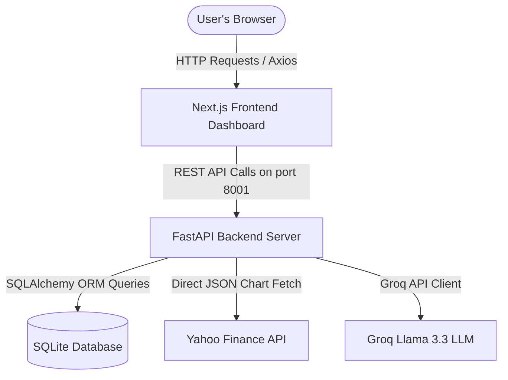
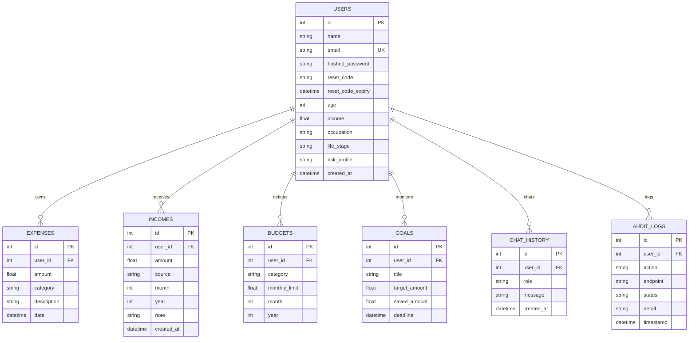

# FinPilot AI — Technical & Architecture Documentation

This document provides a comprehensive technical reference for the **FinPilot AI** personal finance advisor application. It outlines the architecture, database schema, API routes, frontend components, and AI integration systems.

---

## 1. Project Overview

### Problem Statement
Personal finance management is often fragmented and tedious. Users must jump between banking apps, spreadsheet trackers, and investment brokers. Most solutions fail to provide **actionable financial recommendations** tailored to the user's specific stage of life, income, and spending patterns.

### Target Users
* **Students**: Tracking minimal income, learning budgeting patterns, and planning small goals.
* **Freelancers**: Managing irregular income sources and varying monthly expenses.
* **Corporate Professionals**: Tracking savings benchmarks, analyzing investment calculators, and monitoring market trends.

### Key Differentiators
1. **Context-Aware AI Financial Advisor**: Leverages user transactions (income, budgets, expense history) to generate precise advice rather than generic financial tips.
2. **Dynamic Normalized Market Comparisons**: Solves the scaling discrepancy in multi-asset charts by indexing Nifty 50, Gold, Silver, and Platinum to a base 100 on Day 1.
3. **Automated Trade Signal Alerts**: Calculates true Wilder's RSI and triggers email alerts during buy/sell thresholds.

---

## 2. Architecture Overview

FinPilot AI is built as a split decoupled architecture:
1. **Frontend Dashboard**: Next.js client-side application utilizing Tailwind CSS and Recharts.
2. **Backend API**: FastAPI python web server utilizing SQLAlchemy ORM and SQLite.



### Data Flow
1. **Authentication**: Users log in. Next.js saves the JWT token to `localStorage`. Every API request includes this token inside the `Authorization: Bearer <token>` header.
2. **Data Aggregation**: The dashboard requests `/analytics/dashboard` or `/market/stock,gold,silver,platinum`.
3. **Database Processing**: SQLAlchemy retrieves the user's records from the local SQLite `finance.db` file.
4. **Calculations / AI Inference**: If the advisor page is loaded, the backend bundles the user's financial profile into a structured context window and sends it to the Groq Llama 3.3 API.

---

## 3. Feature & Page Documentation

### 🏠 Landing Page
* **Purpose**: Gateway screen handling logins, registrations, password resets, and demo account creations.
* **Main File**: `finance-agent-frontend/app/page.js`
* **Screenshot**: `./docs/images/landing_page.png`
* **Key Logic**: The **Try Demo Account** button automatically registers a demo user (if it doesn't already exist), logs them in, and populates the dashboard with mock transactions so the user can try the dashboard instantly.

---

### 📊 Dashboard
* **Purpose**: Consolidates overall financial metrics (Income, Expenses, Savings) and showcases the user's **Financial Health Score** and budget consumption.
* **Main File**: `finance-agent-frontend/app/dashboard/page.js`
* **Screenshot**: `./docs/images/dashboard_page.png`
* **Key Logic**:
  * **Financial Health Score**: Calculated on the backend by dividing total savings by total income, factoring in budget overruns, and scoring it out of 100.
  * Category budgets dynamically query expenses in real-time to compute progress percentages.

---

### 💵 Income Management
* **Purpose**: Allows logging income entries with specific sources, months, and years.
* **Main File**: `finance-agent-frontend/app/income/page.js`
* **Screenshot**: `./docs/images/income_page.png`
* **Key Logic**: Computes monthly totals and aggregates items by year. Saves entries directly into the SQLite database.

---

### 📉 Expense Tracker
* **Purpose**: Logs daily expenses under custom categories (Food, Bills, Rent, Shopping, Entertainment, Others).
* **Main File**: `finance-agent-frontend/app/expenses/page.js`
* **Screenshot**: `./docs/images/expenses_page.png`
* **Key Logic**: Validates amount entries, saves records, and triggers category budget adjustments.

---

### 🎯 Smart Budgets
* **Purpose**: Set category budget limits and check monthly usage.
* **Main File**: `finance-agent-frontend/app/budget/page.js`
* **Screenshot**: `./docs/images/budget_page.png`
* **Key Logic**: Combines category expense aggregates with category budget thresholds to render warnings if usage exceeds 90%.

---

### 🏆 Savings Goals
* **Purpose**: Set and check progress on specific goals (e.g. emergency fund, vacation).
* **Main File**: `finance-agent-frontend/app/goals/page.js`
* **Screenshot**: `./docs/images/goals_page.png`
* **Key Logic**: Circular progress bars calculate `(saved_amount / target_amount) * 100` dynamically.

---

### 📈 Market Insights
* **Purpose**: Displays NIFTY 50 and metal rates in INR. Plots a normalized trend chart for all 4 assets.
* **Main File**: `finance-agent-frontend/app/market/page.js`
* **Screenshot**: `./docs/images/market_page.png`
* **Key Logic**:
  * **Dynamic Chart Normalization**: Avoids scaling issues by indexing all prices to a base value of `100` on Day 1:
    $$\text{Normalized Price}_t = \left( \frac{\text{Price}_t}{\text{Price}_{\text{Day 1}}} \right) \times 100$$
  * **Wilder's RSI**: Calculated on the backend using standard Wilder smoothing to classify overbought/oversold limits.
  * **AI Recommendation**: Frontend logic parses RSI and warns/recommends assets based on oversold indicators.

---

### 🧠 AI Advisor Chat
* **Purpose**: Direct chat terminal with FinPilot AI for wealth advice.
* **Main File**: `finance-agent-frontend/app/advisor/page.js`
* **Screenshot**: `./docs/images/advisor_page.png`
* **Key Logic**: Retrieves SQLAlchemy models (User's budgets, income, expense averages) and injects them as a system prompt to Llama 3.3.

---

### 📐 Wealth Analytics
* **Purpose**: Advanced financial data visualization.
* **Main File**: `finance-agent-frontend/app/analytics/page.js`
* **Screenshot**: `./docs/images/analytics_page.png`
* **Key Logic**: Integrates Recharts `BarChart` for monthly income/expense comparison and a `PieChart` for category expense distribution.

---

### 🧮 SIP Calculator
* **Purpose**: Planning tool to calculate compound investment returns.
* **Main File**: `finance-agent-frontend/app/calculator/page.js`
* **Screenshot**: `./docs/images/calculator_page.png`
* **Key Logic**: Evaluates future value of an ordinary annuity:
    $$FV = P \times \frac{(1 + i)^n - 1}{i} \times (1 + i)$$
    Where $P$ is monthly SIP investment, $i$ is periodic monthly rate, and $n$ is total months.

---

## 4. Database Schema

FinPilot AI uses a SQLite relational database managed via **SQLAlchemy**.



---

## 5. AI Integration

The advisor chat endpoint routes requests directly to the Groq API utilizing a system instruction template.

### Prompt Contextualization Flow
When a user requests advice or chats with the AI, the backend compile service (`finance_advisor.py`) constructs the prompt:
1. **User Profile**: Pulls user age, annual income, occupation, and calculated risk profile (e.g. Aggressive for business owners, Conservative for students).
2. **Current Financial State**: Adds total monthly income, category budget limits, and average monthly expense aggregates.
3. **Injected Instructions**: 
   * *"You are FinPilot AI, a professional financial advisor. Analyze the user's details and provide actionable wealth strategies. Be concise and use tables where helpful."*
4. **Groq Call**: Sends the structured chat payloads to `llama-3.3-70b-versatile`. Features automatic API key rotation and retry loops.

---

## 6. API Routes Documentation

All API requests expect standard JSON headers. Routes marked with 🔒 require a Bearer JWT Token in the headers.

| Route | Method | Description | Auth Required |
| :--- | :--- | :--- | :--- |
| `/auth/register` | `POST` | Registers a new user profile | No |
| `/auth/login` | `POST` | Validates credentials and returns JWT token | No |
| `/auth/forgot-password` | `POST` | Generates and sends reset code to email | No |
| `/auth/reset-password` | `POST` | Resets user password using reset code | No |
| `/user/profile` | `GET` | Fetches authenticated user profile | **Yes (🔒)** |
| `/user/profile` | `PUT` | Updates authenticated user profile details | **Yes (🔒)** |
| `/income/` | `GET` | Lists income entries | **Yes (🔒)** |
| `/income/` | `POST` | Logs a new income transaction | **Yes (🔒)** |
| `/income/{income_id}` | `DELETE` | Removes an income transaction | **Yes (🔒)** |
| `/expenses/` | `GET` | Lists expense entries | **Yes (🔒)** |
| `/expenses/` | `POST` | Logs a new expense transaction | **Yes (🔒)** |
| `/expenses/{expense_id}` | `DELETE` | Removes an expense transaction | **Yes (🔒)** |
| `/budget/` | `GET` | Lists category budget thresholds | **Yes (🔒)** |
| `/budget/` | `POST` | Creates or updates budget thresholds | **Yes (🔒)** |
| `/goals/` | `GET` | Lists savings goals | **Yes (🔒)** |
| `/goals/` | `POST` | Creates a new savings goal | **Yes (🔒)** |
| `/goals/{goal_id}` | `PUT` | Updates progress on a savings goal | **Yes (🔒)** |
| `/goals/{goal_id}` | `DELETE` | Removes a savings goal | **Yes (🔒)** |
| `/analytics/dashboard` | `GET` | Aggregates all dashboard KPIs and health score | **Yes (🔒)** |
| `/market/{asset_types}` | `GET` | Fetches live market prices and histories from Yahoo API | **Yes (🔒)** |
| `/ai/chat` | `POST` | Submits message to Llama 3.3 and returns advisor reply | **Yes (🔒)** |

---

## 7. Environment Variables

The backend application expects the following variables to be defined in `.env`:

| Variable | Required | Description | Default |
| :--- | :--- | :--- | :--- |
| `GROQ_API_KEY_1` | `Yes` | Primary Groq API Key | - |
| `DATABASE_URL` | `Yes` | Database connection string | `sqlite:///./data/finance.db` |
| `GMAIL_ADDRESS` | `No` | GMail email address for sending alerts | `24x7financeadvisor@gmail.com` |
| `GMAIL_APP_PASSWORD` | `No` | GMail SMTP App-specific password | - |

---

## 8. Deployment Guide

### Frontend Deployment (Vercel)
Next.js frontends can be deployed seamlessly to Vercel:
1. Connect your GitHub repository to Vercel.
2. In the Vercel dashboard, specify the root directory as `finance-agent-frontend`.
3. Add the environment variable:
   - `NEXT_PUBLIC_API_URL` (URL of your deployed FastAPI backend).

### Backend Deployment (Docker-based VPS)
To deploy the backend to a VPS or Cloud host:
1. Ensure Docker and Docker Compose are installed.
2. Create your `.env` file in the backend directory.
3. Build and spin up the backend:
   ```bash
   docker compose up --build -d
   ```

---

## 9. Future Roadmap

1. **Auto Bank Syncing (Plaid/Open Banking)**: Securely import transaction data automatically.
2. **Tax Estimation Module**: Simple calculator to forecast tax brackets and suggest exemptions.
3. **Multi-Currency Support**: Convert entries dynamically based on recent exchange rates.
4. **Push Notifications**: Mobile alerts when a category budget hits 90%.
5. **AI Goal Planner**: Prompt-based goal generation (e.g. "I want to buy a house in 5 years, plan my budget").
