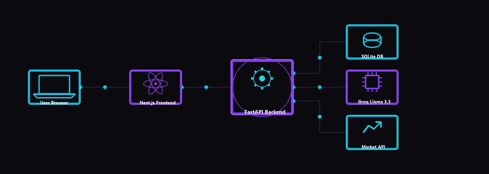
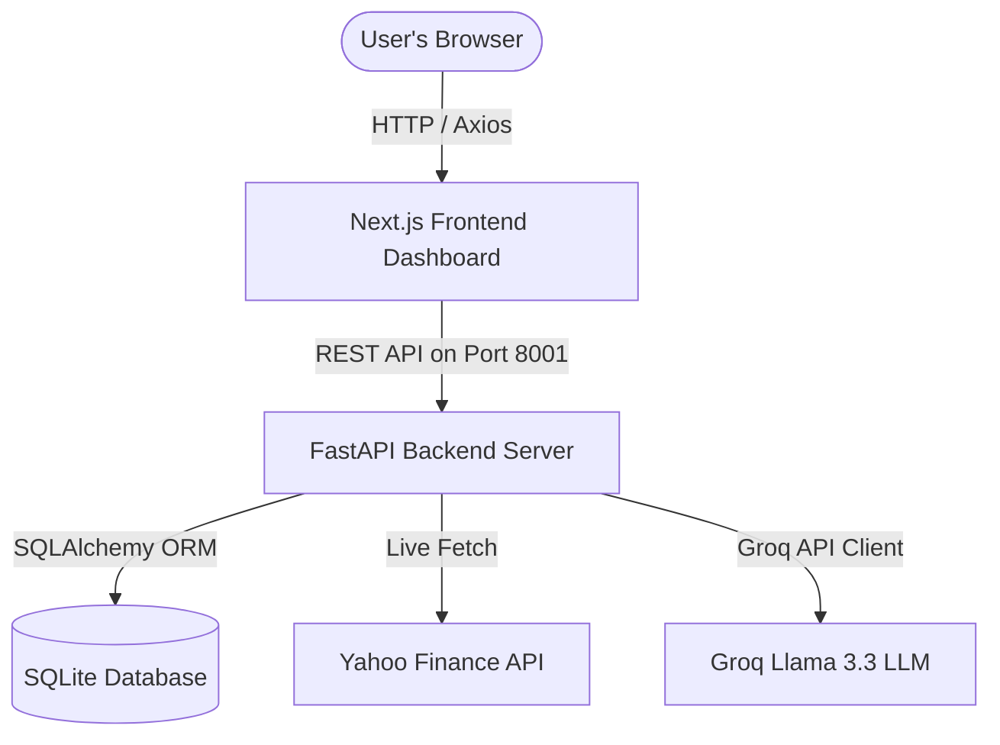
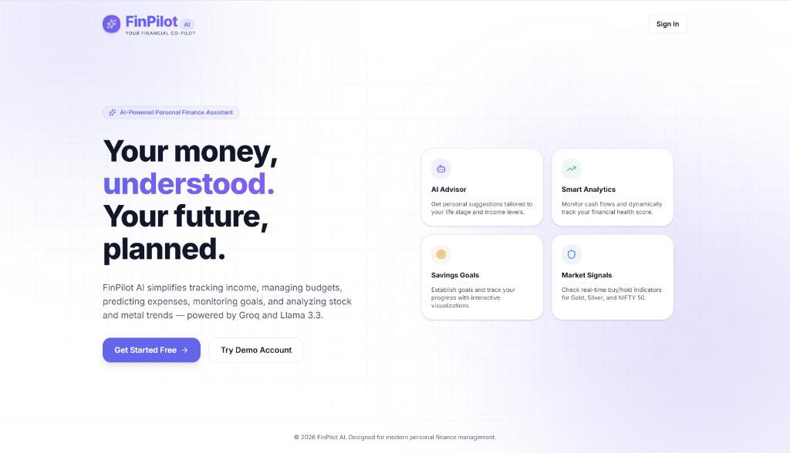
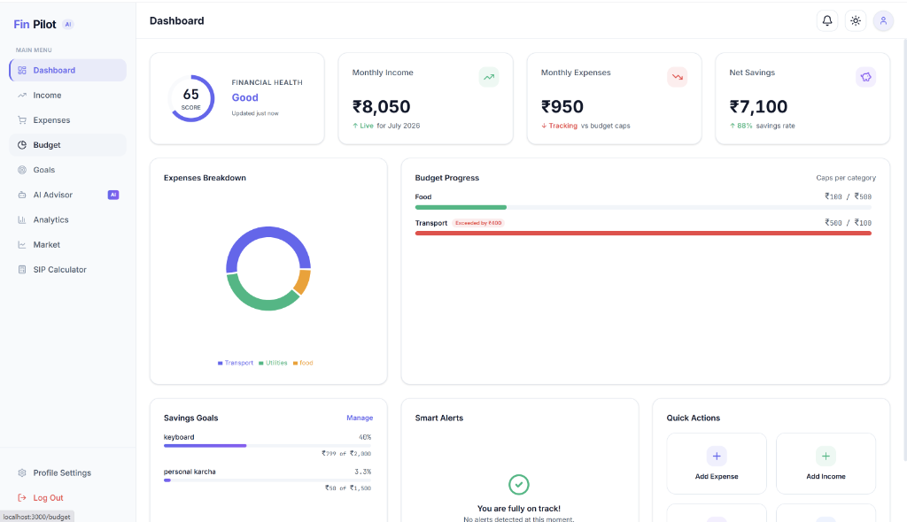
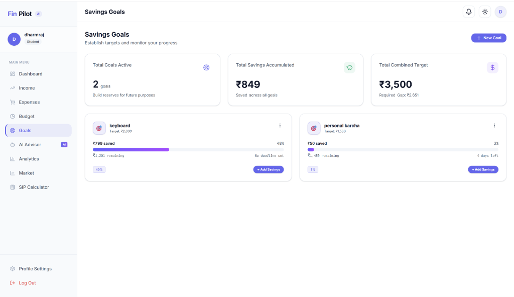
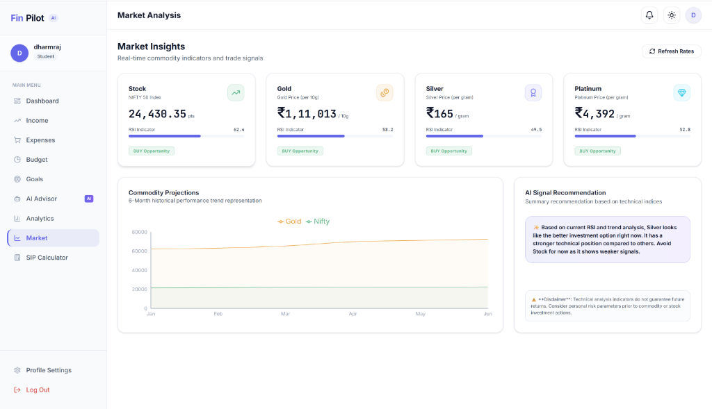
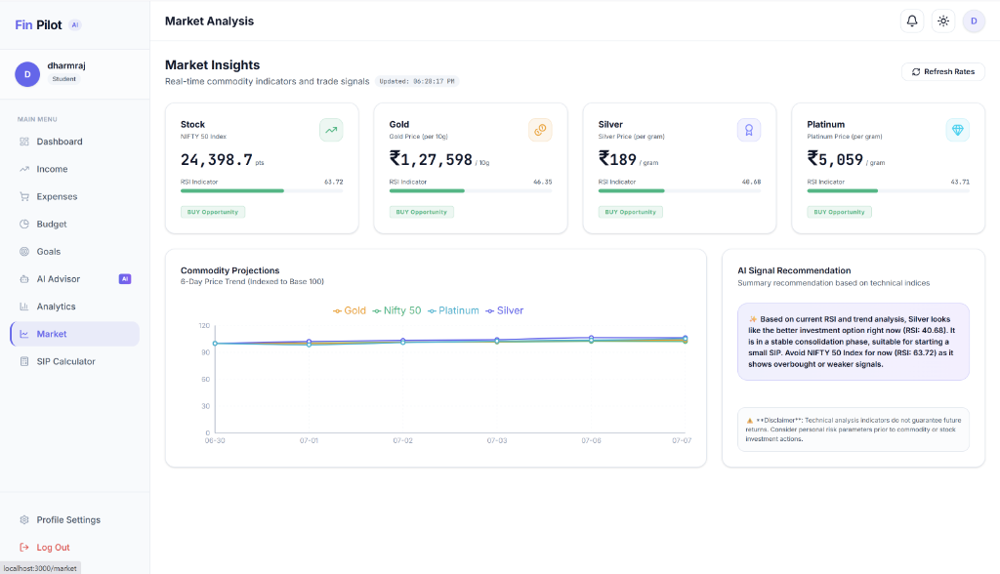
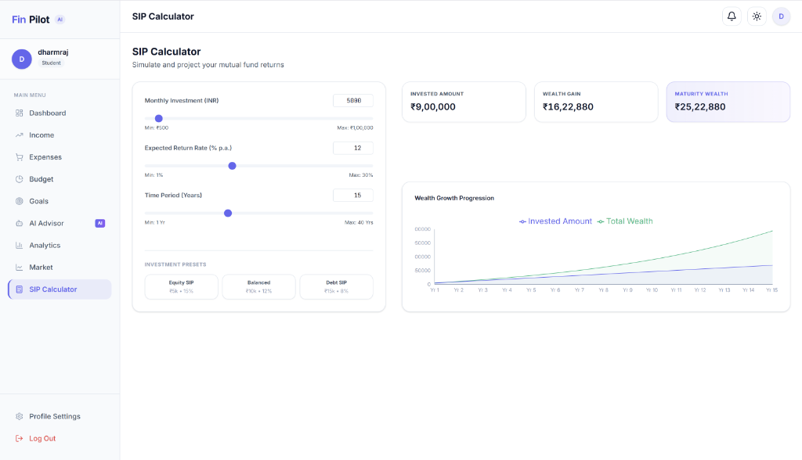
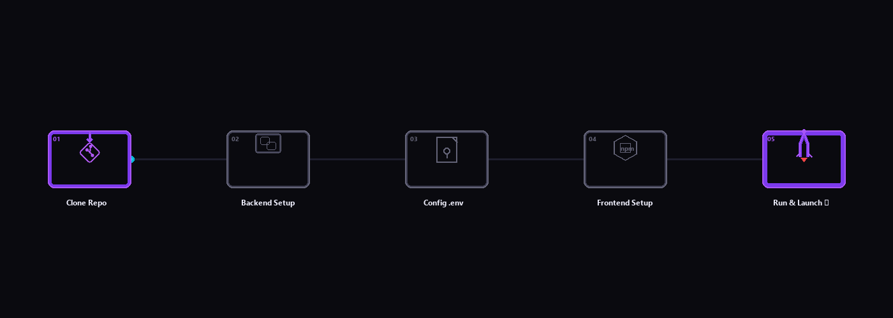

<div align="center">

# 🧭 FinPilot AI

### Personal Finance Advisor — Powered by Groq · Llama 3.3 · Next.js · FastAPI


[](#)
[](#)
[](#)
[](#)
[](#)
[](#)
[](#)
[](#)

<p align="center">
  <b>FinPilot AI</b> is a production-ready, full-stack personal finance web application that helps you track income, expenses, budgets, and savings goals, while providing AI-powered financial advice tailored to your life stage, risk profile, and real transaction data.
</p>

[🚀 Getting Started](#-getting-started) · [📸 Screenshots Showcase](#-screenshots-showcase) · [🛠 Tech Stack](#-tech-stack) · [📡 API Reference](#-api-reference) · [🧠 AI Context Engine](#-ai-context-engine) · [🗺 Roadmap](#-roadmap)

</div>

---

## 🌟 Key Features

| Module | What it does |
|:---|:---|
| 🔐 **Auth System** | JWT-based secure signup/login, password reset using Gmail OTP. |
| 👤 **Life Stage Engine** | Automatically detects your financial profile (Student to Retired) on registration. |
| 💵 **Income Tracker** | Log salary, freelance, business, or other income types with month/year filtering. |
| 📉 **Expense Manager** | Categorized expense logger with donut charts & dynamic AI spend prediction banner. |
| 📊 **Budget Planner** | Set monthly category limits, check live progress bars, and receive warning alerts. |
| 🎯 **Savings Goals** | Set goals with target amounts/deadlines, track progress, and top-up on the fly. |
| 📈 **Market Insights** | Real-time commodity (Gold/Silver/Platinum) & NIFTY 50 rates with RSI buy/sell alerts. |
| 🤖 **AI Advisor Chat** | Contextual Llama 3.3-70b chat session loaded with your live financial metrics. |
| 📐 **Wealth Analytics** | Cash flow trends, category breakdown, health score audits, and smart notifications. |
| 🧮 **SIP Calculator** | Compound mutual fund return projections with interactive sliders. |

---

## 🏗 System Architecture

FinPilot AI separates user-facing dashboard logic from core processing engines via a decoupled client-server architecture:

<p align="center">
  
</p>



---

## 📸 Screenshots Showcase

> [!NOTE]
> Below are real application screenshots showing the current state of the FinPilot AI web dashboard.

<details>
<summary><b>🏠 Landing Page</b></summary>
<br>
<p>Clean landing page with smooth background grids and clear access routes to registration, login, and interactive sandbox demo modes.</p>

</details>

<details>
<summary><b>📊 Main Dashboard</b></summary>
<br>
<p>An aggregate overview of your financial health indicators, including Health Score calculations, monthly cash flows, expense breakdown donut charts, budget caps, savings targets, and smart notifications.</p>

</details>

<details>
<summary><b>🎯 Savings Goals</b></summary>
<br>
<p>Establish, top up, and monitor progress metrics for your savings targets (e.g. purchasing electronics, emergency reserves) with detailed progress percentages and timelines.</p>

</details>

<details>
<summary><b>📈 Market Insights Dashboard</b></summary>
<br>
<p>Track Nifty 50 and commodity metals (Gold/Silver/Platinum) in real-time. Displays technical Wilder RSI indicator buy/sell opportunities alongside base-100 performance trend charts.</p>
<h4>Commodity Projections & Signals</h4>

<h4>Live Localhost Workspace View</h4>

</details>

<details>
<summary><b>🧮 SIP Calculator</b></summary>
<br>
<p>Simulate monthly mutual fund investment compound returns with adjustable sliders for investment caps, expected yield percentages, and maturity years.</p>

</details>

---

## 🛠 Tech Stack

<p align="center">
  
</p>

### Frontend Client
* **Next.js 16** — App Router, SSR, Server Components
* **React 19** — Interactive client-side component trees
* **Tailwind CSS v4** — High-performance utility-first styling
* **shadcn/ui (Nova Theme)** — Premium custom visual styling elements
* **Recharts 3.x** — Interactive charts and financial plots
* **Axios 1.x & sonner** — Request pipelines with JWT interception & custom toast alerts

### Backend Server & Database
* **FastAPI 0.115** — High-performance Python ASGI backend
* **SQLAlchemy 2.x** — Relational database ORM session manager
* **SQLite** — Local file-based data engine
* **Pydantic v2** — Strong serialization and validation schemas
* **Jose & Passlib (Bcrypt)** — Secure hashing & JWT operations
* **yfinance & ta** — Financial market tickers and technical indicator calculations
* **slowapi** — Request rate limiter policies
* **Gmail SMTP** — Automated OTP password reset verification

---

## ⚡ Getting Started

<p align="center">
  
</p>

### 📋 Prerequisites
- **Python 3.10+**
- **Node.js 20+**
- A **[Groq API Key](https://console.groq.com/)**
- A Gmail account with an **[App Password](https://support.google.com/accounts/answer/185833)** activated

---

<p align="center">
  
</p>

### Step 1: Clone the Repository
```bash
git clone https://github.com/your-username/finpilot-ai.git
cd finpilot-ai
```

---

### Step 2: Backend Setup
1. Navigate into the backend directory and set up a virtual environment:
   ```bash
   cd finance-agent-backend
   python -m venv .venv
   ```
2. Activate the virtual environment:
   * **Windows Powershell**:
     ```powershell
     .venv\Scripts\Activate.ps1
     ```
   * **Linux/macOS**:
     ```bash
     source .venv/bin/activate
     ```
3. Install the backend dependencies:
   ```bash
   pip install -r requirements.txt
   ```
4. Create a `.env` configuration file inside `finance-agent-backend/`:
   ```env
   GROQ_API_KEY_1=your_groq_key_here
   DATABASE_URL=sqlite:///./data/finance.db
   GMAIL_ADDRESS=your@gmail.com
   GMAIL_APP_PASSWORD=your_app_password
   ```
5. Run the FastAPI development server:
   ```bash
   uvicorn app.main:app --reload --port 8001
   ```
   > 💡 **Swagger Docs**: Access the interactive API workspace at [http://localhost:8001/docs](http://localhost:8001/docs)

---

### Step 3: Frontend Setup
1. Open a new terminal window and navigate into the frontend directory:
   ```bash
   cd finance-agent-frontend
   ```
2. Install the required Node packages:
   ```bash
   npm install
   ```
3. Run the local development server:
   ```bash
   npm run dev
   ```
   > 🚀 **App Host**: Access the web dashboard in your browser at [http://localhost:3000](http://localhost:3000)

---

## 📡 API Reference

Full Swagger documentation is accessible at `http://localhost:8001/docs`. Below is a breakdown of the primary endpoints:

### 🔐 Authentication Operations
* `POST /auth/register` — Create a new user profile
* `POST /auth/login` — Authenticate details and obtain JWT token
* `POST /auth/forgot-password` — Generate & email a temporary OTP
* `POST /auth/reset-password` — Change password using validated OTP

### 💰 Financial Transaction Records (Require 🔒 JWT)
* `GET /income/` & `POST /income/` — Log, view, or remove incoming cash flows
* `GET /expenses/` & `POST /expenses/` — Manage outgoing categorized transactions
* `GET /budget/` & `POST /budget/` — Update and retrieve spending threshold parameters
* `GET /goals/` & `POST /goals/` — Manage savings milestones
* `POST /goals/{id}/add-savings` — Add a savings top-up to a specific goal

### 📊 AI Analytics & Market Data (Require 🔒 JWT)
* `GET /market/{asset_types}` — Retrieve real-time commodity data (Nifty 50, Gold, Silver, Platinum)
* `POST /ai/chat` — Send messages to the Llama 3.3-70b advisor client
* `GET /analytics/dashboard` — Fetch calculated financial indicators & Health Scores
* `GET /analytics/predictions` — Query the AI-powered expense forecast models

---

## 🧠 AI Context Engine

When chatting with the **FinPilot AI** assistant, the server compiles a unified profile representation to enrich the LLM's system instruction:

```
+-------------------------------------------------------------+
| User Demographics: Age, Occupation, Life Stage, Risk Level   |
+-------------------------------------------------------------+
| Account Balances: Monthly Income, Savings Rate, Net Asset   |
+-------------------------------------------------------------+
| Budgets: Category caps, current usage ratios                |
+-------------------------------------------------------------+
| Active Savings Goals: Deadlines, target vs current amounts |
+-------------------------------------------------------------+
                              |
                              v
             [ Groq Llama-3.3-70b-versatile ]
                              |
                              v
    Tailored, actionable financial recommendations
```

This guarantees that answers are hyper-customized, avoiding generic financial advice.

---

## 🛡 Security Practices
* **Bcrypt Hashing**: Multi-pass password hashing via Passlib.
* **JWT Guard Rails**: Protected endpoints require standard HS256 tokens with a 24-hour expiry limit.
* **Rate Limiting**: Defends API boundaries from brute force requests using Slowapi.
* **OTP Expiration**: Email OTP codes valid for exactly 10 minutes.

---

## 🗺 Roadmap
- [ ] **Plaid Bank Integration**: Auto-import transaction histories directly.
- [ ] **Tax Forecast Module**: Real-time tax liability forecasting and optimization tools.
- [ ] **Multi-Currency Framework**: Dynamic exchange rates based on global FX rates.
- [ ] **Push Notification Channels**: Mobile-push alerts for budget overrides.
- [ ] **AI-driven Goal Planner**: Conversational plans to hit long-term goals (e.g. "Plan my budget for a house").
- [ ] **Docker Compose Orchestration**: Boot full stack with a single command.
- [ ] **Interactive Dark Theme**: Ready styling handles in CSS variables.

---

## 🤝 Contributing
Contributions make the open-source community amazing!
1. Fork this Repository.
2. Create a Feature Branch (`git checkout -b feature/AmazingFeature`).
3. Commit your changes (`git commit -m 'Add some AmazingFeature'`).
4. Push to the Branch (`git push origin feature/AmazingFeature`).
5. Open a Pull Request.

---

## 📨 Contact & Support
For any questions, feedback, or support regarding FinPilot AI, feel free to reach out:
* **Email**: [dharmrajv532@gmail.com](mailto:dharmrajv532@gmail.com)

---

## 📄 License
This project is licensed under the MIT License - see the [LICENSE](LICENSE) file for details.

---

<div align="center">
  Built with ❤️ using <b>FastAPI + Next.js + Groq AI</b>
  <br>
  <i>"Your money, understood. Your future, planned."</i>
</div>
